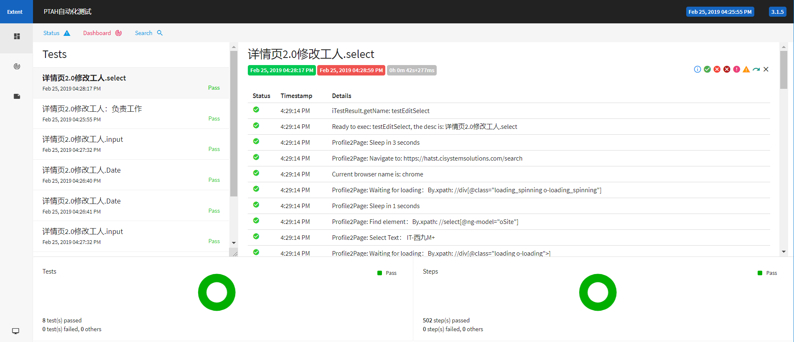

### 框架介绍
1. 使用selenium+maven+testng并发调用远程浏览器
2. 使用Selenium Gird实现远程浏览器调用
3. 使用[ExtendReport](http://extentreports.com/)作为该框架结果报告
4. 使用log4j记录操作，方便定位问题
5. 测试数据写于config，测试数据与代码分离
6. 继承了[binarywang](https://github.com/binarywang/java-testdata-generator)的随机数据生成器

### 代码介绍
1. 根据PageObject设计模式进行该框架的开发
2. 继承TestNG的IAnnotationTransformer，IRetryAnalyzer接口实现了用例失败时自动重跑。条件是抛出的异常是TimeoutException
3. ExtentTestNGIReporterListener继承TestNG的IReporter接口，实现了日志报告
4. log4j使用贯穿于整个测试过程，生成的日志在logs中
5. PropertiesUtil使.properties文件可以使用变量

### 环境搭建
要调用远程浏览器，需要配置Selenium Grid Hub and Nodes。[理解docker和selenium hub的概念看这里](https://www.cnblogs.com/fnng/p/8358326.html)。

这里介绍[SeleniumHQ官方项目](https://github.com/seleniumHQ/docker-selenium)中docker+docker-compose的搭建方法：
1. 在linux上安装docker和docker-conpose环境
2. 新建一个docker-selenium.yaml文件，写入：
```yaml
version: "3"
services:
  selenium-hub:
    image: selenium/hub:3.141.59-gold
    container_name: selenium-hub
    ports:
      - "4444:4444"
  chrome:
    image: selenium/node-chrome:3.141.59-gold
    volumes:
      - /dev/shm:/dev/shm
    depends_on:
      - selenium-hub
    environment:
      - HUB_HOST=selenium-hub
      - HUB_PORT=4444
  firefox:
    image: selenium/node-firefox:3.141.59-gold
    volumes:
      - /dev/shm:/dev/shm
    depends_on:
      - selenium-hub
    environment:
      - HUB_HOST=selenium-hub
      - HUB_PORT=4444
```
3. 命令行运行：`docker-compose -f docker-selenium.yaml up`
### 使用
在page下新建一个class，新增成员变量：
```$java
//通过成员变量管理页面的元素
private By input_serch = By.id("kw");
private By btn_search = By.xpath("//input[@value=\"百度一下\"]");
private By first_search_result = By.xpath("//div[@id=\"1\"]/h3");
```
在class中编写方法：
```$java
    //方法管理页面的行为
    public void clickSearch(String searchText) {
        sendKeys(input_serch,searchText);
        click(btn_search);
    }
```
在BaseSetup的initPage中：
```$java
    //同一创建page对象
    public void initPage() {
        this.baiduPage = new BaiduPage(this.driver);
    }
```
在test/java中新建一个class：
```$java
    //测试报告会使用description作为用例名称，如没有，则使用方法名
    @Test(description = "搜索是否正常")
    public void testSearch() {
        String generate = ChineseNameGenerator.getInstance().generate();
        baiduPage.clickSearch(generate);

        String searchResult = baiduPage.getSearchResult();
        Assert.assertEquals(searchResult,generate);
    }
```
最后要并发远程调用浏览器需要使用testng.xml运行：
```$xml
<?xml version="1.0" encoding="UTF-8"?>
<!DOCTYPE suite SYSTEM "http://testng.org/testng-1.0.dtd">
<suite name="Suite" parallel="tests" thread-count="2">
    <listeners>
        <listener class-name="listener.AnnotationTransformer"/>
        <listener class-name="listener.ExtentTestNGIReporterListener"/>
        <listener class-name="listener.MyITestListener"/>
    </listeners>
    <test verbose="2" preserve-order="true" name="chrome">
        <parameter name="browser" value="chrome"/>
        <classes>
            <class name="SearchTest"/>
        </classes>
    </test> <!-- Test -->
    <test verbose="2" preserve-order="true" name="firfox">
        <parameter name="browser" value="firfox"/>
        <classes>
            <class name="SearchTest"/>
        </classes>
    </test> <!-- Test -->
</suite> <!-- Suite -->
```
随机数据生成器使用：
```$java
//英文名
String expectEngGeneratorName = EnglishNameGenerator.getInstance().generate();
//中文名
String expectChiGeneratorName = ChineseNameGenerator.getInstance().generate();
//手机号码
String expectPhoneNum = ChineseMobileNumberGenerator.getInstance().generate();
//地址
String expectPassportAddress = ChineseIDCardNumberGenerator.generateIssueOrg();
```
### 报告


