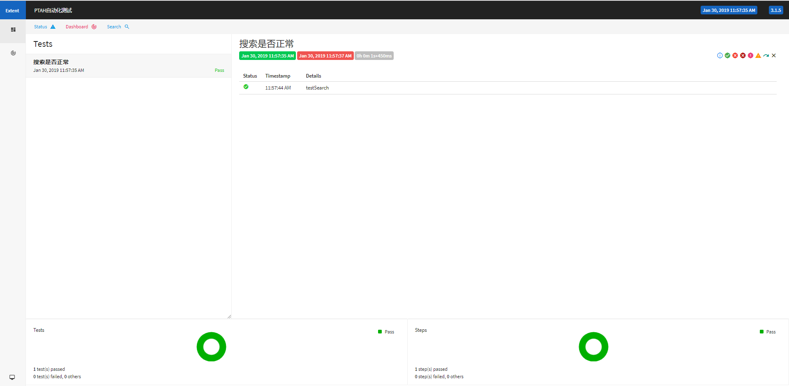

### 介绍
基于PageObject（PO）设计模式，对Java+Seleium进行二次开发，集成了包管理工具Maven，单元测试框架TestNG，日志框架log4j，随机数据生成器，测试报告使用ExtendReport。

### 随机测试数据
集成随机测试数据生成器，详细用法：https://github.com/binarywang/java-testdata-generator
```
# 生成中文名
String name = ChineseNameGenerator.getInstance().generate();
# 英文名
String name = EnglishNameGenerator.getInstance().generate();
# 地址
String generatedAddress = ChineseAddressGenerator.getInstance().generate();
```

### 报告



